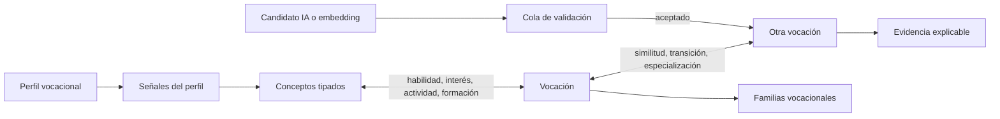

# Vocari · Vocational Knowledge Graph en Supabase

## Decisión técnica

El MVP usa PostgreSQL/Supabase en lugar de una base de grafos. El volumen inicial de 100–300 vocaciones, las consultas de vecinos y las rutas de hasta seis saltos caben bien en tablas relacionales, índices compuestos y CTE recursivos. Esto conserva una única fuente de verdad, RLS, auditoría y transacciones.

El diseño visual de “sistema solar” se mantiene como capa de presentación. La base expone nodos y relaciones sin imponer coordenadas ni estilos, por lo que la interfaz actual puede evolucionar sin migrar datos.

## Ontología implementada

- `vocations`: profesión o ruta vocacional navegable.
- `vocational_concepts`: nodo tipado para `skill`, `interest`, `activity`, `industry`, `education_path`, `knowledge_area`, `tool`, `work_environment` y `subject`.
- `vocational_families`: agrupación editorial; una vocación puede pertenecer a varias familias.
- `vocation_concept_links`: relaciones semánticas entre vocaciones y conceptos.
- `vocation_relationships`: relaciones entre vocaciones, con similitud y transición independientes.
- `vocation_relationship_evidence`: evidencia normalizada para explicar habilidades compartidas, brechas y aprendizajes.
- `vocational_profiles` y `vocational_profile_signals`: perfil exploratorio del usuario, válido para primera vocación o reconversión.
- `vocational_recommendation_*`: ejecución, ranking y evidencia histórica del motor.
- `vocational_candidate_relationships`: propuestas de reglas, embeddings o LLM pendientes de revisión.
- `vocational_sources` y `vocational_graph_audit_log`: trazabilidad, versión y auditoría.



## Scoring auditable

Similitud vocacional:

```text
0.30 habilidades + 0.20 intereses + 0.15 actividades +
0.15 conocimiento + 0.10 entorno + 0.10 industria
```

Transición profesional:

```text
0.40 habilidades transferibles + 0.15 conocimiento + 0.10 industria +
0.10 entorno + 0.10 educación reutilizable + 0.15 (1 - barrera credencial)
```

Los scores se calculan con trigger desde sus dimensiones. No se aceptan números finales arbitrarios como fuente primaria.

El matching de perfil suma contribuciones trazables por concepto y reserva 15% para afinidad RIASEC. RIASEC aporta una señal, nunca un diagnóstico ni una “profesión ideal”.

## Seguridad

- RLS está activo en todas las tablas.
- Visitantes solo leen conocimiento publicado y verificado.
- Cada persona administra únicamente su perfil y señales.
- Orientadores y administradores gestionan el grafo mediante `vocational_is_graph_admin()`.
- La `service_role` queda reservada al backend y a procesos de ingestión.
- Relaciones inferidas no entran directamente al grafo: pasan por la cola de candidatos.

## RPC disponibles

- `get_related_vocations(vocation, relation, result_limit)`
- `find_vocational_paths(source_vocation, target_vocation, max_depth)`
- `match_vocational_profile(profile_user_id, result_limit)`

## Aplicación

```bash
npx supabase link --project-ref cbtdgaptdpfhaufyijnd
npx supabase db push
```

Validación local o contra una base de ensayo:

```bash
psql "$DATABASE_URL" -v ON_ERROR_STOP=1 \
  -f supabase/migrations/20260912190000_vocational_knowledge_graph.sql \
  -f supabase/tests/vocational_knowledge_graph.sql
```

## Datos iniciales

El esquema queda listo para importar 100–300 vocaciones, pero no incluye demanda laboral, salarios o requisitos académicos sin fuentes. La primera carga debe registrar `source_id`, `version`, `confidence` y estado de validación. Las relaciones propuestas por embeddings deben permanecer en `vocational_candidate_relationships` hasta revisión editorial.

## Evolución

1. MVP: PostgreSQL, reglas explicables, top-N y rutas cortas.
2. V2: `pgvector` para generar candidatos; validación humana antes de aceptar aristas.
3. V3: evaluar Neo4j/ArangoDB únicamente si las rutas profundas, el volumen o la latencia dejan de cumplir objetivos medidos.
