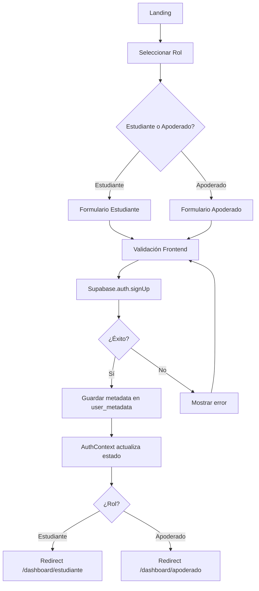

# Skill 01: Autenticación de Usuarios

## Propósito

Gestionar el registro, inicio de sesión, roles y persistencia de sesión de usuarios (Estudiantes y Apoderados) en OrientaIA usando Supabase Auth.

---

## Responsabilidades

- [x] Registro de nuevos usuarios (Estudiante y Apoderado)
- [x] Login de usuarios existentes
- [x] Logout (cierre de sesión)
- [x] Recuperación de contraseña (forgot password)
- [x] Validación de sesiones activas
- [x] Gestión de roles (student / parent)
- [x] Protección de rutas privadas
- [x] Gestión de tokens JWT
- [x] Vinculación Apoderado ↔ Estudiante
- [x] Manejo de errores de autenticación

---

## Entradas

### Registro Estudiante
```typescript
{
  tipo: "estudiante",
  email: string,           // Email válido
  password: string,        // Mínimo 8 caracteres
  nombre: string,
  edad: number,           // 14-25 años
  curso: string,          // Ej: "3° Medio", "4° Medio"
  colegio?: string,       // Opcional
  region?: string         // Chile: Metropolitana, Valparaíso, etc.
}
```

### Registro Apoderado
```typescript
{
  tipo: "apoderado",
  email: string,
  password: string,
  nombre: string,
  email_hijo?: string     // Email del estudiante para vincular (opcional)
}
```

### Login
```typescript
{
  email: string,
  password: string
}
```

### Forgot Password
```typescript
{
  email: string
}
```

---

## Salidas

### Registro/Login Exitoso
```typescript
{
  ok: true,
  user: {
    id: string,                    // UUID
    email: string,
    rol: "estudiante" | "apoderado",
    metadata: {
      nombre: string,
      edad?: number,
      curso?: string,
      colegio?: string,
      region?: string,
      hijo_id?: string            // Solo para apoderados
    },
    created_at: string
  },
  session: {
    access_token: string,
    refresh_token: string,
    expires_at: number
  }
}
```

### Error
```typescript
{
  ok: false,
  error: string,
  code?: string
}
```

**Códigos de error comunes:**
- `email_already_exists` - Email ya registrado
- `invalid_credentials` - Credenciales inválidas
- `weak_password` - Contraseña muy débil
- `invalid_email` - Email mal formado
- `user_not_found` - Usuario no existe
- `session_expired` - Sesión expirada

---

## Restricciones

### Seguridad
- **Contraseñas:** Mínimo 8 caracteres, al menos 1 número
- **Validación email:** Formato válido (regex)
- **Rate limiting:** Máximo 5 intentos de login por IP en 15 minutos
- **Tokens JWT:**
  - Access token: 1 hora de expiración
  - Refresh token: 30 días de expiración
- **No confirmación de email en MVP** (simplificar onboarding)

### Negocio
- Un email = una cuenta
- Roles mutuamente excluyentes (no puede ser estudiante Y apoderado con mismo email)
- Apoderado puede vincular múltiples hijos
- Estudiante solo puede tener un apoderado vinculado

### UX
- Mensajes de error claros en español
- No revelar si un email existe (seguridad)
- Feedback inmediato en validación de formularios
- Redirección automática post-login según rol

---

## Dependencias

### Externas
- **Supabase Auth** - Servicio de autenticación
- **Supabase Database** - Tabla `users` con metadata y `parent_student_links`

### Internas - Frontend
```
src/lib/auth/
├── supabaseClient.js        # Cliente Supabase
├── AuthContext.jsx          # Context API para estado global
├── useAuth.js               # Hook personalizado
└── ProtectedRoute.jsx       # Componente para rutas protegidas

src/pages/Auth/
├── Login.jsx
├── Register.jsx
├── ForgotPassword.jsx
└── SelectRole.jsx           # Seleccionar si es estudiante o apoderado
```

### Internas - Backend
```
netlify/functions/
├── auth-link-parent.js      # Vincular apoderado con estudiante
└── auth-get-profile.js      # Obtener perfil completo del usuario
```

---

## Estados / Flujo

### Flujo de Registro



### Flujo de Login

```
[Usuario] → [Formulario Login]
    ↓
[Validación frontend: email + password]
    ↓
[Supabase.auth.signInWithPassword()]
    ↓
    ├─ ✅ Válido → [Retorna session + user]
    │               ↓
    │          [AuthContext.setUser(user)]
    │               ↓
    │          {¿Rol?}
    │               ├─ Estudiante → [/dashboard/estudiante]
    │               └─ Apoderado → [/dashboard/apoderado]
    │
    └─ ❌ Inválido → [Error "Credenciales inválidas"]
                      ↓
                 [Mostrar mensaje en UI]
```

### Flujo de Sesión Persistente

```
[App carga] → [AuthContext.useEffect]
    ↓
[Supabase.auth.getSession()]
    ↓
    ├─ ✅ Session válida
    │   ↓
    │   [Cargar user.metadata]
    │   ↓
    │   [AuthContext.setUser(user)]
    │   ↓
    │   [Usuario autenticado - mantener en página actual]
    │
    └─ ❌ No session
        ↓
        [Usuario no autenticado]
        ↓
        [Si está en ruta protegida → Redirect /login]
```

### Flujo de Vinculación Apoderado ↔ Estudiante

```
Opción 1: Apoderado invita a Estudiante
1. Apoderado ingresa email del hijo en dashboard
2. Sistema envía email de invitación al estudiante
3. Estudiante hace clic en link y se registra
4. Sistema automáticamente vincula ambas cuentas

Opción 2: Estudiante comparte código
1. Estudiante genera código de 6 dígitos en dashboard
2. Apoderado ingresa código en su dashboard
3. Sistema vincula ambas cuentas

MVP: Usar Opción 2 (más simple, no requiere email)
```

---

## Casos de Uso

### 1. Estudiante Nuevo - Registro

**Actor:** Visitante sin cuenta (estudiante de 3° o 4° medio)

**Objetivo:** Crear cuenta para acceder a test vocacional

**Flujo:**
1. Visitante hace clic en "Crear cuenta" en landing
2. Selecciona rol "Estudiante"
3. Completa formulario:
   - Email: `juan.perez@gmail.com`
   - Contraseña: `MiPassword123`
   - Nombre: `Juan Pérez`
   - Edad: `17`
   - Curso: `3° Medio`
   - Colegio: `Liceo Metropolitano`
4. Submit → Validación frontend
5. Supabase crea usuario con `rol: "estudiante"`
6. Redirección automática a `/dashboard/estudiante`
7. Mensaje de bienvenida: "¡Hola Juan! Comienza tu test vocacional"

### 2. Apoderado - Registro y Vinculación

**Actor:** Padre/madre de estudiante

**Objetivo:** Crear cuenta para ver progreso de su hijo/a

**Flujo:**
1. Apoderado hace clic en "Crear cuenta"
2. Selecciona rol "Apoderado"
3. Completa formulario:
   - Email: `maria.gonzalez@gmail.com`
   - Contraseña: `Password456`
   - Nombre: `María González`
4. Submit → Cuenta creada con `rol: "apoderado"`
5. Redirección a `/dashboard/apoderado`
6. Dashboard muestra: "Vincular con mi hijo/a"
7. Apoderado solicita código de vinculación a su hijo
8. Estudiante genera código: `A7B3C9`
9. Apoderado ingresa código en dashboard
10. Sistema valida y crea link en tabla `parent_student_links`
11. Dashboard apoderado ahora muestra progreso del estudiante

### 3. Usuario Existente - Login

**Actor:** Usuario registrado (estudiante o apoderado)

**Objetivo:** Acceder a su cuenta

**Flujo:**
1. Usuario hace clic en "Iniciar sesión"
2. Ingresa credenciales
3. Submit → Supabase valida
4. Sesión creada → Redirección según rol
5. Usuario ve su dashboard correspondiente

### 4. Olvidó Contraseña

**Actor:** Usuario registrado que olvidó su contraseña

**Objetivo:** Recuperar acceso a cuenta

**Flujo:**
1. Usuario hace clic en "Olvidé mi contraseña"
2. Ingresa email
3. Supabase envía email con link de reset
4. Usuario hace clic en link
5. Ingresa nueva contraseña
6. Contraseña actualizada → Redirect a login

### 5. Protección de Rutas Privadas

**Actor:** Visitante no autenticado

**Objetivo:** Evitar acceso a rutas privadas

**Flujo:**
1. Visitante intenta acceder directamente a `/dashboard/estudiante`
2. `<ProtectedRoute>` detecta que no hay sesión activa
3. Redirección automática a `/login`
4. Mensaje: "Debes iniciar sesión para acceder"

---

## Notas de Implementación

### Opción Recomendada: Supabase Auth Directo

**Ventajas:**
- ✅ Menos código backend
- ✅ Auth manejado por Supabase (seguro y escalable)
- ✅ RLS (Row Level Security) nativo
- ✅ Webhooks para eventos de auth

### Frontend - React

```javascript
// src/lib/auth/supabaseClient.js
import { createClient } from '@supabase/supabase-js'

export const supabase = createClient(
  import.meta.env.VITE_SUPABASE_URL,
  import.meta.env.VITE_SUPABASE_ANON_KEY
)

// src/lib/auth/AuthContext.jsx
import { createContext, useContext, useEffect, useState } from 'react'
import { supabase } from './supabaseClient'

const AuthContext = createContext()

export function AuthProvider({ children }) {
  const [user, setUser] = useState(null)
  const [loading, setLoading] = useState(true)

  useEffect(() => {
    // Check active session on mount
    supabase.auth.getSession().then(({ data: { session } }) => {
      setUser(session?.user ?? null)
      setLoading(false)
    })

    // Listen for auth changes
    const { data: { subscription } } = supabase.auth.onAuthStateChange(
      (_event, session) => {
        setUser(session?.user ?? null)
      }
    )

    return () => subscription.unsubscribe()
  }, [])

  const signUp = async (email, password, metadata) => {
    const { data, error } = await supabase.auth.signUp({
      email,
      password,
      options: {
        data: metadata  // { rol, nombre, edad, curso, colegio, region }
      }
    })
    return { data, error }
  }

  const signIn = async (email, password) => {
    const { data, error } = await supabase.auth.signInWithPassword({
      email,
      password
    })
    return { data, error }
  }

  const signOut = async () => {
    await supabase.auth.signOut()
  }

  const resetPassword = async (email) => {
    const { data, error } = await supabase.auth.resetPasswordForEmail(email)
    return { data, error }
  }

  const value = {
    user,
    loading,
    signUp,
    signIn,
    signOut,
    resetPassword
  }

  return (
    <AuthContext.Provider value={value}>
      {!loading && children}
    </AuthContext.Provider>
  )
}

export const useAuth = () => {
  const context = useContext(AuthContext)
  if (!context) {
    throw new Error('useAuth must be used within AuthProvider')
  }
  return context
}

// src/lib/auth/ProtectedRoute.jsx
import { Navigate } from 'react-router-dom'
import { useAuth } from './AuthContext'

export function ProtectedRoute({ children, requiredRole }) {
  const { user } = useAuth()

  if (!user) {
    return <Navigate to="/login" replace />
  }

  if (requiredRole && user.user_metadata?.rol !== requiredRole) {
    // Redirect a su dashboard correcto
    const redirectPath = user.user_metadata?.rol === 'estudiante'
      ? '/dashboard/estudiante'
      : '/dashboard/apoderado'
    return <Navigate to={redirectPath} replace />
  }

  return children
}
```

### Ejemplo de Uso en App.jsx

```javascript
import { BrowserRouter, Routes, Route } from 'react-router-dom'
import { AuthProvider } from './lib/auth/AuthContext'
import { ProtectedRoute } from './lib/auth/ProtectedRoute'
import Landing from './pages/Landing'
import Login from './pages/Auth/Login'
import Register from './pages/Auth/Register'
import DashboardEstudiante from './pages/DashboardEstudiante'
import DashboardApoderado from './pages/DashboardApoderado'

function App() {
  return (
    <AuthProvider>
      <BrowserRouter>
        <Routes>
          <Route path="/" element={<Landing />} />
          <Route path="/login" element={<Login />} />
          <Route path="/register" element={<Register />} />

          <Route
            path="/dashboard/estudiante"
            element={
              <ProtectedRoute requiredRole="estudiante">
                <DashboardEstudiante />
              </ProtectedRoute>
            }
          />

          <Route
            path="/dashboard/apoderado"
            element={
              <ProtectedRoute requiredRole="apoderado">
                <DashboardApoderado />
              </ProtectedRoute>
            }
          />
        </Routes>
      </BrowserRouter>
    </AuthProvider>
  )
}

export default App
```

### Base de Datos - Supabase

```sql
-- Tabla automática de Supabase: auth.users
-- Contiene: id, email, encrypted_password, user_metadata, created_at

-- Tabla personalizada para vínculos apoderado-estudiante
CREATE TABLE parent_student_links (
  id UUID PRIMARY KEY DEFAULT uuid_generate_v4(),
  parent_id UUID REFERENCES auth.users(id) ON DELETE CASCADE,
  student_id UUID REFERENCES auth.users(id) ON DELETE CASCADE,
  link_code VARCHAR(6),
  link_status VARCHAR(20) DEFAULT 'pending',  -- pending | active
  created_at TIMESTAMP DEFAULT NOW(),
  activated_at TIMESTAMP,
  UNIQUE(parent_id, student_id)
);

-- Row Level Security
ALTER TABLE parent_student_links ENABLE ROW LEVEL SECURITY;

-- Política: Los apoderados solo ven sus vínculos
CREATE POLICY "Apoderados ven sus vínculos"
  ON parent_student_links
  FOR SELECT
  USING (auth.uid() = parent_id);

-- Política: Los estudiantes solo ven sus vínculos
CREATE POLICY "Estudiantes ven sus vínculos"
  ON parent_student_links
  FOR SELECT
  USING (auth.uid() = student_id);
```

---

## Checklist de Implementación

### Frontend
- [ ] Instalar `@supabase/supabase-js`
- [ ] Crear `src/lib/auth/supabaseClient.js`
- [ ] Crear `src/lib/auth/AuthContext.jsx`
- [ ] Crear `src/lib/auth/useAuth.js` (hook)
- [ ] Crear `src/lib/auth/ProtectedRoute.jsx`
- [ ] Crear `src/pages/Auth/SelectRole.jsx`
- [ ] Crear `src/pages/Auth/Login.jsx`
- [ ] Crear `src/pages/Auth/Register.jsx`
- [ ] Crear `src/pages/Auth/ForgotPassword.jsx`
- [ ] Configurar rutas en `App.jsx`
- [ ] Agregar validación de formularios (react-hook-form)

### Backend
- [ ] Configurar Supabase project
- [ ] Configurar variables de entorno:
  - `VITE_SUPABASE_URL`
  - `VITE_SUPABASE_ANON_KEY`
  - `SUPABASE_SERVICE_ROLE_KEY` (backend only)
- [ ] Crear tabla `parent_student_links`
- [ ] Configurar RLS policies
- [ ] Crear función `netlify/functions/auth-link-parent.js`
- [ ] Configurar email templates en Supabase (opcional)

### Testing
- [ ] Probar registro estudiante
- [ ] Probar registro apoderado
- [ ] Probar login con credenciales correctas
- [ ] Probar login con credenciales incorrectas
- [ ] Probar persistencia de sesión (reload página)
- [ ] Probar logout
- [ ] Probar protección de rutas
- [ ] Probar vinculación apoderado-estudiante
- [ ] Probar recuperación de contraseña

---

**Estado:** 🟡 Pendiente de implementación
**Prioridad:** 🔴 Alta (bloqueante para todas las demás features)
**Dependencias bloqueantes:** Ninguna
**Tiempo estimado:** 2-3 días

**Última actualización:** 2025-12-31
