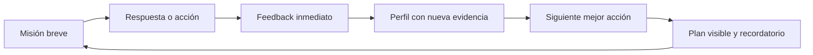

# Vocari Web — Experiencia de orientación continua v1

> Estado: propuesta para ejecución
> Fecha: 2026-08-04
> Producto principal: `app.vocari.cl` (Next.js + FastAPI + PostgreSQL)
> Adquisición: `vocari.cl`

## 1. Visión

Vocari debe ayudar a una persona a pasar de la incertidumbre a una decisión informada mediante pequeñas acciones, evidencia acumulada y acompañamiento continuo. La referencia de Duolingo se adopta como modelo de claridad, hábito y progresión, no como una copia visual ni como una competencia por puntos.

La promesa es:

> “Cada semana entiendo mejor qué caminos encajan conmigo y doy un paso verificable hacia uno de ellos.”

## 2. Principios de producto

1. Una misión principal por sesión. La persona siempre sabe qué hacer ahora y por qué.
2. Progreso basado en evidencia. Los puntos representan acciones útiles: completar una reflexión, contrastar una hipótesis, investigar una ruta o realizar un experimento real.
3. Dos recorridos, un mismo perfil. Vocación inicial y reconversión comparten identidad, habilidades, intereses, restricciones, evidencias e historial.
4. IA como acompañante, no como juez. El motor determinista propone rutas; la IA explica, pregunta, resume y adapta el siguiente paso.
5. Mercado laboral con fecha y fuente. Ninguna predicción se presenta como certeza.
6. Gamificación cuidadosa. Se celebra la constancia sin castigar pausas ni empujar respuestas rápidas.
7. Privacidad por diseño. Especial atención a menores, consentimiento, datos sensibles y trazabilidad de recomendaciones.
8. Español e inglés desde el modelo de dominio, no solo desde la interfaz.

## 3. Audiencias y trabajos a resolver

### 3.1 Exploración vocacional inicial

Persona que todavía no construye una identidad laboral clara. Necesita:

- descubrir intereses, valores y formas preferidas de trabajar;
- diferenciar carrera, ocupación y estilo de vida;
- conocer alternativas universitarias, técnicas y no tradicionales;
- contrastar recomendaciones con experiencias reales;
- conversar con familia u orientadores usando evidencia;
- decidir sin sentir que un test dicta su futuro.

### 3.2 Reconversión laboral

Persona con experiencia laboral que necesita cambiar de rol, industria o forma de trabajar. Necesita:

- reconocer habilidades transferibles y activos ya acumulados;
- explicitar restricciones económicas, familiares, geográficas y de tiempo;
- entender qué tareas cambiarán con IA y cuáles aumentan su valor;
- comparar rutas por bienestar, ingreso, duración, riesgo y fricción;
- validar hipótesis antes de pagar una formación extensa;
- ejecutar un plan de transición de 30 y 90 días.

## 4. El bucle central de Vocari

Cada misión debe durar entre 3 y 12 minutos. Una misión completa puede aumentar el “impulso” semanal, otorgar Puntos de Exploración (PE), actualizar una dimensión del perfil y desbloquear el siguiente nodo del camino.

## 5. Onboarding común

### Paso 1 — Elección de intención

- “Estoy descubriendo qué quiero hacer.”
- “Quiero cambiar o mejorar mi rumbo laboral.”

La elección define `journey_type = first_vocation | career_transition`. Puede cambiarse después sin perder evidencia.

### Paso 2 — Resultado que busca

Elegir una meta concreta:

- encontrar 3 opciones compatibles;
- elegir estudios o formación;
- cambiar de trabajo;
- construir un plan de reconversión;
- entender fortalezas y preferencias.

### Paso 3 — Ritmo sostenible

- suave: 2 misiones por semana;
- constante: 3 misiones por semana;
- intensivo: 5 misiones por semana.

La racha de Vocari se llama **Impulso** y se mide por semanas con el objetivo cumplido. No se reinicia por perder un día. Una “Semana flexible” protege pausas justificadas.

### Paso 4 — Primera victoria antes del registro

La persona completa una misión de 3–5 minutos y recibe una primera señal útil. Para guardar el resultado crea su cuenta con Google o enlace mágico por correo. La sesión invitada se migra a la cuenta.

## 6. Camino: vocación inicial

### Etapa 1 — Conócete

1. pulso de claridad y expectativas;
2. test RIASEC dividido en lecciones breves;
3. mapa de energía e intereses;
4. valores y condiciones de vida.

Salida: perfil inicial, código Holland explicado y nivel de certeza.

### Etapa 2 — Amplía opciones

1. descubrir familias de ocupaciones;
2. comparar ruta universitaria, técnica, certificaciones y aprendizaje en trabajo;
3. comprender tareas, no solo nombres de carreras;
4. explorar cómo IA transforma cada familia laboral.

Salida: lista amplia de 8–12 opciones con evidencia a favor y dudas abiertas.

### Etapa 3 — Contrasta

1. juegos de habilidades;
2. simulaciones de un día real;
3. comparación de opciones y trade-offs;
4. preguntas para entrevistas informativas.

Salida: shortlist de 3 opciones y mapa de riesgos.

### Etapa 4 — Experimenta

1. microproyecto o actividad real;
2. entrevista a una persona del campo;
3. revisión de malla, costos y empleabilidad;
4. reflexión de evidencia antes/después.

Salida: evidencia externa, no solo autopercepción.

### Etapa 5 — Decide y planifica

1. matriz de decisión;
2. conversación con Valeria u orientador humano;
3. plan de 30 y 90 días;
4. revisión programada de la decisión.

## 7. Camino: reconversión laboral

### Etapa 1 — Diagnostica el presente

1. situación laboral, energía y bienestar;
2. restricciones de ingreso, tiempo, ubicación e idioma;
3. urgencia y tolerancia al riesgo;
4. objetivo de transición.

### Etapa 2 — Reconoce tus activos

1. inventario de logros y tareas;
2. habilidades transferibles con evidencia;
3. mapa de energía laboral;
4. perfil de valores y entorno preferido.

### Etapa 3 — Genera hipótesis

1. rutas adyacentes de baja fricción;
2. rutas de crecimiento con formación corta;
3. rutas de reinvención de mayor inversión;
4. impacto estimado de IA sobre tareas y habilidades complementarias.

### Etapa 4 — Compara y valida

Cada ruta muestra:

- ajuste personal;
- ingreso como rango y fuente;
- tiempo de preparación;
- costo y costo de oportunidad;
- brecha de habilidades;
- necesidad de inglés o relocalización;
- tareas automatizables y tareas potenciadas por IA;
- experimento barato para validarla.

### Etapa 5 — Ejecuta la transición

1. ruta seleccionada y alternativa de respaldo;
2. plan de aprendizaje;
3. proyecto de portafolio o prueba laboral;
4. plan de networking y postulaciones;
5. seguimiento de 30 y 90 días.

## 8. Sistema de progresión

### Elementos

- **Puntos de Exploración (PE):** premian evidencia, no respuestas “correctas”.
- **Impulso semanal:** semanas en que se cumple el ritmo elegido.
- **Nivel de camino:** Explorando → Conociéndome → Contrastando → Experimentando → Decidiendo → En movimiento.
- **Mapa de nodos:** muestra completados, misión actual, próximos y premium.
- **Colecciones:** fortalezas, valores, habilidades transferibles y evidencias.
- **Hitos compartibles:** tarjetas sin datos sensibles para redes o personas de confianza.

### Reglas éticas

- no hay ranking público de indecisión ni de “mejores perfiles”;
- no se pierden PE por equivocarse;
- cambiar de hipótesis es progreso;
- la racha no debe generar culpa ni bloquear contenido esencial;
- la velocidad al responder nunca mejora el resultado psicométrico.

## 9. Modelo freemium

### Gratis — debe resolver un problema real

- onboarding y cuenta individual;
- perfil base y recorrido elegido;
- test RIASEC completo;
- primeras misiones y un juego base;
- perfil resumido y 3 rutas iniciales;
- misión semanal y registro de progreso;
- una muestra guiada de Valeria;
- guardar y compartir resumen básico;
- recordatorios configurables.

### Premium individual

- conversaciones continuas con Valeria y memoria longitudinal;
- preguntas y misiones adaptativas;
- todos los juegos y simulaciones;
- comparador avanzado y escenarios de IA/mercado;
- rutas ilimitadas y plan 30/90 días;
- informes bilingües y exportación;
- seguimiento de objetivos y revisiones mensuales;
- descuentos o acceso a orientación humana según plan.

### Instituciones

- cohortes y asignación de caminos;
- paneles de avance y alertas, con mínima exposición de datos personales;
- orientadores humanos y notas;
- reportes agregados;
- administración, consentimiento y auditoría;
- configuración de marca y contenidos locales.

### Principio de paywall

El pago desbloquea profundidad, personalización y continuidad. Nunca oculta el resultado base después de que la persona entrega sus datos o completa un test.

## 10. Valeria, agente de orientación

### Responsabilidades

- hacer preguntas que aumenten claridad;
- explicar resultados y contradicciones;
- convertir evidencia en una siguiente acción;
- ayudar a comparar rutas y trade-offs;
- mantener planes y revisarlos con el usuario;
- derivar a orientación humana ante situaciones sensibles o alta incertidumbre.

### Límites

- no decide una carrera por la persona;
- no inventa salarios, demanda ni requisitos;
- no diagnostica salud mental;
- no promete empleabilidad;
- no usa datos de otros usuarios como explicación individual;
- identifica claramente inferencias, fuentes y fecha de datos.

### Arquitectura

1. El motor determinista construye contexto, rutas permitidas y siguiente mejor acción.
2. El LLM redacta, pregunta y adapta dentro de ese contexto.
3. Un validador comprueba estructura, fuentes, seguridad y presencia de acciones.
4. Se registra versión de prompt/modelo, entradas resumidas, acciones ofrecidas y aceptadas.
5. La memoria útil se guarda como hechos estructurados; no se depende del historial completo del chat.

## 11. Adquisición y crecimiento orgánico

### Embudo principal

1. contenido social/SEO responde una pregunta concreta;
2. microdiagnóstico público de 3–5 minutos;
3. primera señal útil visible;
4. registro para guardar y continuar;
5. primera misión completa en la misma sesión;
6. recordatorio hacia la segunda evidencia;
7. invitación premium cuando el usuario necesita profundidad.

### Activos para redes

- “Mi mapa de energía laboral” compartible;
- comparación “lo que hago / lo que me energiza”;
- mini simuladores de trabajos en la era de IA;
- historias reales de transición con evidencia y plazos;
- desafíos de 7 días para explorar una ruta;
- enlaces con `utm_source`, `utm_campaign`, `content_id` y `journey_type`.

## 12. Internacionalización

- locales iniciales: `es-CL` y `en`;
- rutas públicas localizadas: `/es/...` y `/en/...`;
- preferencia guardada en usuario y cookie;
- claves por dominio: `common`, `auth`, `journey`, `assessment`, `careers`, `reconversion`, `advisor`, `billing`, `errors`;
- fechas, números y monedas mediante `Intl`;
- contenido de carreras separado por país/mercado;
- eventos analíticos con nombres estables en inglés y propiedades normalizadas;
- prompts versionados por idioma, con los mismos contratos de salida;
- diseño tolerante a expansión de texto y preparado para idiomas RTL futuros.

## 13. Métrica norte y métricas de producto

### Métrica norte

**Usuarios activos semanales que completan una acción vocacional basada en evidencia (WAEU).**

No basta abrir la app o conversar: debe completarse una misión que agregue evidencia al perfil o ejecute un paso del plan.

### Métricas del embudo

- visita → microdiagnóstico iniciado;
- microdiagnóstico → primera señal completada;
- primera señal → registro;
- registro → primera misión completada (activación);
- retención D1, D7, W4 y W8 por `journey_type`;
- misiones completadas por usuario activo;
- porcentaje que construye shortlist o ruta de transición;
- premium view → trial → pago → renovación;
- costo por conversación y por usuario premium;
- tasa de aceptación y finalización de acciones sugeridas por Valeria.

### Métricas de resultado

- variación de claridad declarada;
- porcentaje con 3 rutas contrastadas;
- porcentaje con experimento real completado;
- porcentaje con plan 30/90 días;
- decisión confirmada o revisada a 30/90 días;
- utilidad percibida y confianza calibrada, no solo satisfacción.

## 14. Eventos mínimos

Todos incluyen `event_id`, `occurred_at`, `anonymous_id`, `user_id?`, `session_id`, `locale`, `journey_type?`, `source`, `app_version` y `properties`.

- `landing_viewed`
- `micro_assessment_started`
- `micro_assessment_completed`
- `signup_started`
- `signup_completed`
- `journey_selected`
- `mission_viewed`
- `mission_started`
- `mission_completed`
- `profile_evidence_added`
- `path_node_unlocked`
- `weekly_momentum_earned`
- `advisor_message_sent`
- `advisor_action_offered`
- `advisor_action_accepted`
- `route_saved`
- `route_compared`
- `real_world_experiment_completed`
- `paywall_viewed`
- `trial_started`
- `subscription_started`
- `subscription_cancelled`

## 15. Persistencia propuesta

### Tablas nuevas

- `user_journeys`: tipo, objetivo, ritmo, estado y locale.
- `journey_nodes`: catálogo versionado de etapas y misiones.
- `user_node_progress`: estado, intentos, PE y evidencia.
- `profile_evidence`: hechos estructurados con fuente y confianza.
- `user_momentum`: semanas cumplidas y protección flexible.
- `product_events`: eventos append-only para producto.
- `subscriptions`: plan individual, estado, proveedor y periodo.
- `entitlements`: capacidades efectivas por usuario/institución.
- `advisor_threads`: contexto y estado resumido.
- `advisor_messages`: mensajes, modelo, prompt y costo.
- `advisor_actions`: acciones ofrecidas, aceptadas y completadas.

### Reglas

- claves foráneas e índices por usuario/fecha;
- eventos y mensajes con política de retención;
- separar PII de telemetría;
- no guardar texto sensible innecesario en `product_events`;
- migraciones Alembic como fuente de verdad, sin DDL ad hoc al iniciar la aplicación.

## 16. Criterios de aceptación del MVP

1. Un usuario invitado puede obtener una primera señal útil y crear cuenta sin perderla.
2. Al registrarse elige uno de los dos recorridos y ve una misión principal.
3. Cada misión completada queda persistida, actualiza progreso y emite un evento.
4. El dashboard muestra mapa, Impulso, PE, etapa y siguiente acción con datos reales.
5. Vocación inicial y reconversión tienen misiones diferentes sobre el mismo modelo.
6. El contenido crítico funciona en español e inglés.
7. El plan gratuito entrega un resultado completo y el premium se presenta después de valor demostrado.
8. Valeria usa contexto persistido, ofrece una acción trazable y respeta entitlements.
9. Producto/admin puede medir adquisición, activación, retención y resultados por recorrido.
10. Los flujos críticos cuentan con pruebas unitarias, integración y E2E.

